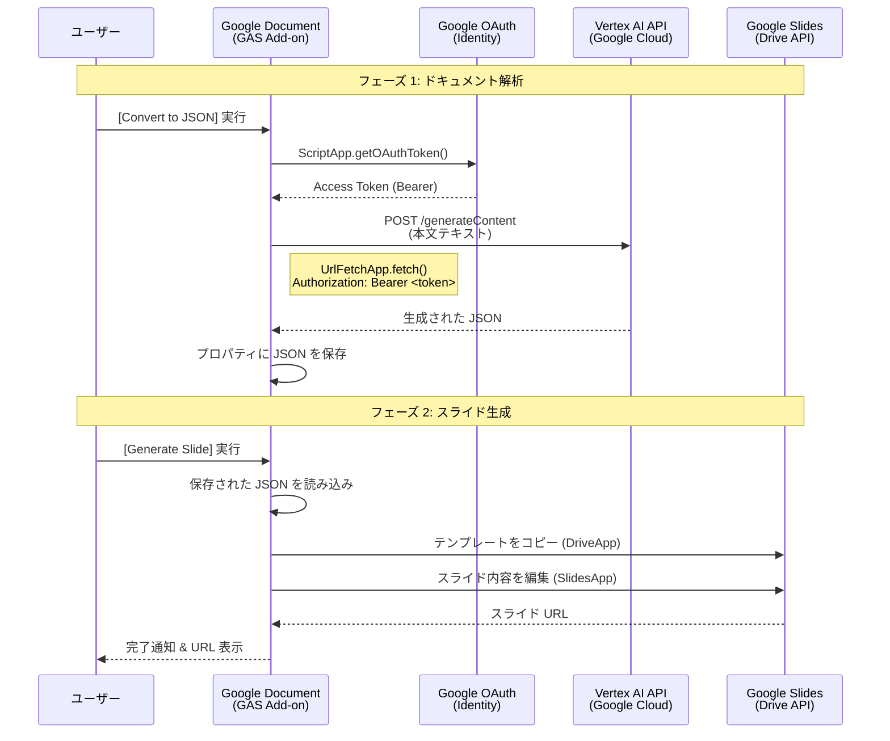

# アーキテクチャ設計書

## 1. システム構成図

本システムは、クライアントサイド（GAS アドオン）と Google Cloud サービス（Vertex AI）を直接連携させる **サーバーレス・クライアント直接接続アーキテクチャ** を採用しています。

## 2. ネットワーク接続詳細

### 2.1. GAS と Google Cloud の関係
Google Apps Script (GAS) は Google の管理ネットワーク上で動作します。これはユーザーの VPC (Virtual Private Cloud) 内 **ではありません**。

### 2.2. Vertex AI への接続方式
- **接続プロトコル**: HTTPS (REST API)
- **エンドポイント**: `https://{location}-aiplatform.googleapis.com/...`
- **認証**: OAuth 2.0 (Bearer Token)
- **ネットワーク経路**: Google 内部のバックボーンネットワーク、またはパブリックインターネットを経由して Google API フロントエンドに到達します。

### 2.3. なぜ VPC や Proxy が不要なのか
- **ID ベースのセキュリティ**: Vertex AI は VPC による境界防御（IP制限）ではなく、IAM (Identity and Access Management) による認証・認可を基本としています。
- **GAS の特権**: GAS の `ScriptApp.getOAuthToken()` は、実行ユーザーの権限で有効な Google API アクセストークンを即座に発行できるため、複雑な認証フローなしで Google Cloud API を叩くことができます。

## 3. データフロー

1.  **Input**: Google Document 本文 (Text)
2.  **Process 1 (AI)**: Text → Vertex AI (LLM) → **Structure (JSON)**
3.  **Intermediate**: JSON データを `DocumentProperties` に一時保存
4.  **Process 2 (App)**: Structure (JSON) + Template Slide → **Output Slide**

## 4. コンポーネント詳細

| コンポーネント | 技術要素 | 役割 |
|---|---|---|
| **Frontend UI** | HTML / CSS (Google Sans) | 設定画面、実行ボタン、ステータス表示、JSONプレビュー |
| **Backend Logic** | Google Apps Script (Node.js 互換) | API 呼び出し、ドキュメント操作、スライド操作 |
| **AI Model** | Google Vertex AI (Gemini 1.5) | 非構造化テキストの構造化、要約、スライド構成案の作成 |
| **Storage** | PropertiesService | 設定値 (GCP Project ID等) や中間データ (JSON) の一時保存 |

## 5. セキュリティ設計

- **認証**: 実行ユーザー自身の Google アカウントを使用。
- **認可**:
    - GAS 実行時に `cloud-platform` スコープの承認を要求。
    - GCP 側で `vertexai.user` ロールを持たないユーザーは API エラーとなりブロックされる。
- **データ保護**:
    - 通信はすべて HTTPS で暗号化。
    - API キー・サービスアカウントキーを使用しないため、鍵の漏洩リスクがない。
