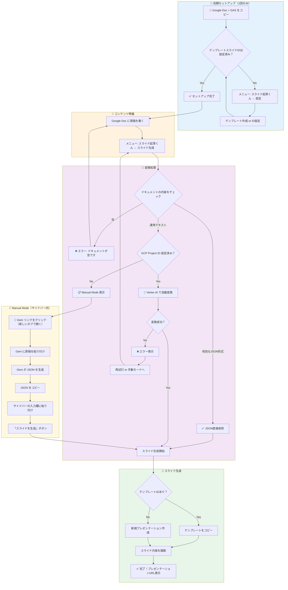
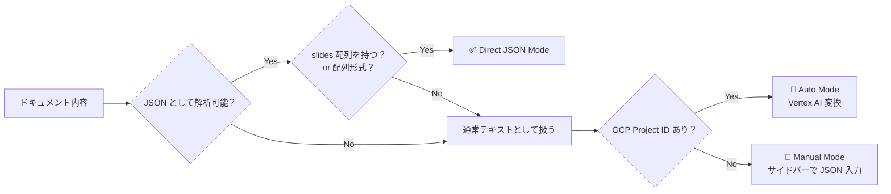

# スライド起草くん - ユーザーフロー図

> **最終更新**: 2025-12-11
> 
> このドキュメントは、GoogleドキュメントからスライドGeneratorを使用してスライドを生成するまでの
> 完全なユーザーフローを図解しています。

---

## 📊 メインフロー図



---

## 📋 フロー詳細

### 1️⃣ 初期セットアップ（1回のみ）

| ステップ | 操作 | 備考 |
|:---:|---|---|
| 1 | Google Doc テンプレートをコピー | GAS スクリプトも一緒にコピーされる |
| 2 | メニュー「スライド起草くん → 設定」を開く | |
| 3 | 「テンプレートを作成」をクリック or テンプレートIDを入力 | 作成すると自動で設定される |
| 4 | （オプション）GCP Project ID を設定 | Vertex AI 自動変換を使う場合のみ |
| 5 | （オプション）Gem URL を設定 | Manual Mode で便利 |

---

### 2️⃣ スライド生成フロー

#### 🅰️ Auto Mode（GCP Project ID 設定済み）

```
原稿を書く → スライド生成 → Vertex AI が JSON 生成 → スライド完成 🎉
```

| ステップ | 操作 | 所要時間 |
|:---:|---|:---:|
| 1 | Google Doc に原稿（文章）を書く | - |
| 2 | メニュー「スライド起草くん → スライド生成」 | - |
| 3 | 自動で Vertex AI が変換 | 10-30秒 |
| 4 | スライドが生成される | 数十秒 |
| 5 | リンクをクリックしてプレゼンテーションを開く | - |

#### 🅱️ Manual Mode（GCP Project ID なし）

```
原稿を書く → スライド生成 → Gem リンクをクリック → Gem で JSON 生成 → 貼り付け → スライド完成 🎉
```

| ステップ | 操作 | 所要時間 |
|:---:|---|:---:|
| 1 | Google Doc に原稿（文章）を書く | - |
| 2 | メニュー「スライド起草くん → スライド生成」 | - |
| 3 | サイドバーに Manual Mode UI が表示される | - |
| 4 | 「🔗 Gem を開く」リンクをクリック | - |
| 5 | Gem に原稿をコピペ | - |
| 6 | Gem の出力（JSON）をコピー | - |
| 7 | サイドバーのテキストエリアに貼り付け | - |
| 8 | 「スライドを生成」ボタンをクリック | 数十秒 |
| 9 | リンクをクリックしてプレゼンテーションを開く | - |

#### 🅲️ Direct JSON Mode（上級者向け）

```
JSON を直接書く → スライド生成 → スライド完成 🎉
```

| ステップ | 操作 | 所要時間 |
|:---:|---|:---:|
| 1 | Google Doc に有効な JSON を直接書く | - |
| 2 | メニュー「スライド起草くん → スライド生成」 | - |
| 3 | JSON が自動検出されてスライド生成 | 数十秒 |
| 4 | リンクをクリックしてプレゼンテーションを開く | - |

---

## 🔀 判定ロジック（内部処理）



---

## 💡 ユーザー視点の簡易フロー

### 初めて使う人向け（Manual Mode）

```
┌─────────────────────────────────────────────────────────────┐
│  1. 📄 コピー    2. ✏️ 原稿    3. ▶️ 実行    4. 🔗 Gem      │
│     ↓              ↓            ↓            ↓              │
│  テンプレート   文章を書く   「スライド   新しいタブで      │
│  をコピー                    生成」       Gem が開く        │
│                              クリック                       │
│                                                             │
│  5. 📋 コピペ   6. 📋 貼付    7. 🎨 完成                   │
│     ↓              ↓            ↓                          │
│  原稿を Gem    JSON を        スライドが                    │
│  に貼り付け    サイドバーに   できあがる！                  │
│  → 出力コピー  貼り付け                                     │
└─────────────────────────────────────────────────────────────┘
```

### 設定済みユーザー向け（Auto Mode）

```
┌─────────────────────────────────────────────────────────────┐
│  1. ✏️ 原稿      2. ▶️ 実行         3. 🎨 完成             │
│     ↓               ↓                  ↓                   │
│  文章を書く     「スライド生成」   プレゼンテーション       │
│                 クリック           リンクをクリック         │
│                 → 自動で待機                               │
└─────────────────────────────────────────────────────────────┘
```

---

## ⚠️ エラーケース

| エラー | 原因 | 対処法 |
|---|---|---|
| ドキュメントが空です | ドキュメントに何も書いていない | 原稿を書いてから再実行 |
| テンプレートがありません | テンプレートIDが未設定 | 設定画面で作成または設定 |
| Vertex AI エラー | API エラー/クォータ/認証 | Manual Mode に切り替え |
| JSON 形式が正しくありません | サイドバーに貼り付けた JSON が不正 | Gem で再生成 |

---

## 📁 関連ファイル

- `Code.ts` - メインロジック（`convertDocumentToJson`関数）
- `GenerateSlideSidebar.html` - サイドバーUI（Manual Mode 含む）
- `SettingsSidebar.html` - 設定画面
